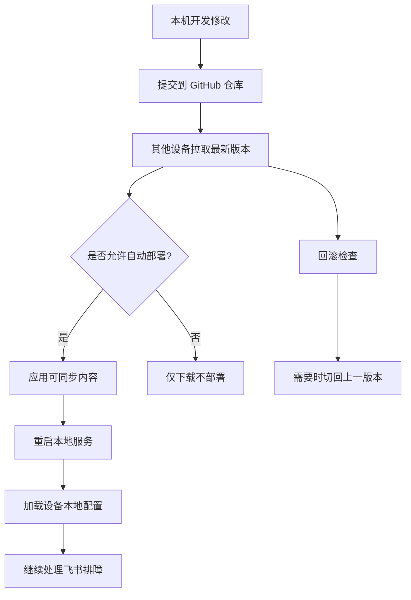

# GitHub 自动同步与分流部署方案

> 目标：把当前排障项目作为可版本化、可同步、可回滚的本地服务部署到其他设备，用于分流或备份，但不改变本机排障主流程。

## 1. 方案目标

1. 将项目代码、知识库 md、提示词模板纳入 GitHub 版本管理。
2. 支持把同一套项目同步到其他设备，作为分流节点或备份节点。
3. 保留每台设备自己的运行时配置、密钥、日志和本地数据。
4. 支持部署记录、版本追踪、回滚和实例登记。
5. 不影响飞书触发、知识检索、SSH 取证和本地排障主流程。

## 2. 设计原则

1. GitHub 同步层只负责分发和版本控制，不参与排障推理。
2. 同步对象必须分清“可同步”和“仅本地”。
3. 生产运行实例不得被未确认同步直接覆盖。
4. 每个设备都应保留自己的环境变量、SSH 凭证、日志和运行态缓存。
5. 同步和回滚必须可审计。

## 3. 适合同步的内容

建议同步的内容：

- `feishu_agent/` 下的代码文件。
- `knowledge/` 下的总入口和细分问题 md。
- `prompts/` 下的提示词模板。
- `README.md`、`AGENTS.md`、`.github/copilot-instructions.md` 这类规范文件。
- 不含敏感信息的示例配置模板。

不建议同步的内容：

- 真实密钥、token、密码。
- 设备专属 SSH 配置。
- 本地日志、bag、autobag、collect 输出。
- 运行态缓存、会话状态、临时诊断结果。
- 机器专属环境变量和值得本地隔离的配置。

## 4. 同步拓扑

## 5. 推荐目录约束

建议把仓库内容分成三类：

### 5.1 可同步

- 业务代码。
- 知识库 md。
- 提示词模板。
- 部署清单模板。
- 非敏感的配置示例。

### 5.2 仅本地

- `.env`、密钥文件、token。
- 设备专属配置。
- 运行日志。
- SSH 私钥和授权信息。
- 临时排障输出。

### 5.3 需要人工确认后同步

- 知识库结构变更。
- 新增或删除 playbook。
- 模型 provider 变更。
- SSH 白名单变更。
- 默认部署策略变更。

## 6. 部署流程

### 6.1 开发机到 GitHub

1. 修改代码或知识库。
2. 本地自检。
3. 提交到 GitHub。
4. 打标签或打版本号。
5. 记录变更摘要。

### 6.2 其他设备拉取

1. 设备检查当前版本。
2. 拉取 GitHub 最新代码。
3. 校验部署清单。
4. 覆盖可同步内容。
5. 保留本地专属配置。
6. 重启服务并做健康检查。

### 6.3 回滚

1. 记录当前版本和部署时间。
2. 检查回滚目标版本。
3. 切回上一稳定版本。
4. 重启并验证。

## 7. 建议实现文件

### 7.1 `feishu_agent/deploy/github_sync.py`

职责：
- 同步 GitHub 仓库内容。
- 拉取、推送、检查版本。
- 对接自动部署入口。

建议接口：
- `sync_from_github()`
- `push_to_github()`
- `check_remote_version()`

### 7.2 `feishu_agent/deploy/manifest.py`

职责：
- 定义可同步清单。
- 标识哪些文件可以分发、哪些必须保留本地。

建议接口：
- `DeployManifest`
- `load_manifest()`
- `validate_manifest()`

### 7.3 `feishu_agent/deploy/rollback.py`

职责：
- 保存部署历史。
- 提供回滚能力。

建议接口：
- `record_deploy()`
- `rollback_to_version()`
- `list_deploy_history()`

## 8. 与主流程的边界

GitHub 自动同步不能做的事：

1. 不能直接参与故障推理。
2. 不能替代飞书入口。
3. 不能替代模型适配层。
4. 不能替代 SSH 取证。
5. 不能覆盖设备专属配置和凭证。

GitHub 自动同步可以做的事：

1. 分发代码和知识库。
2. 分发提示词模板。
3. 分发可复用的 playbook 定义。
4. 记录版本和回滚点。
5. 支持多设备一致性部署。

## 9. 建议验收标准

1. 能把代码和知识库同步到另一台设备。
2. 另一台设备能独立启动并接收飞书排障消息。
3. 设备本地配置不会被同步覆盖。
4. 可以回滚到上一个稳定版本。
5. 版本、部署记录、回滚记录都可追踪。

## 10. 推荐下一步

如果要继续落地，建议先做这三个文件：

1. `feishu_agent/deploy/manifest.py`
2. `feishu_agent/deploy/github_sync.py`
3. `feishu_agent/deploy/rollback.py`

然后再补一份 GitHub Actions 或手工同步脚本方案。
